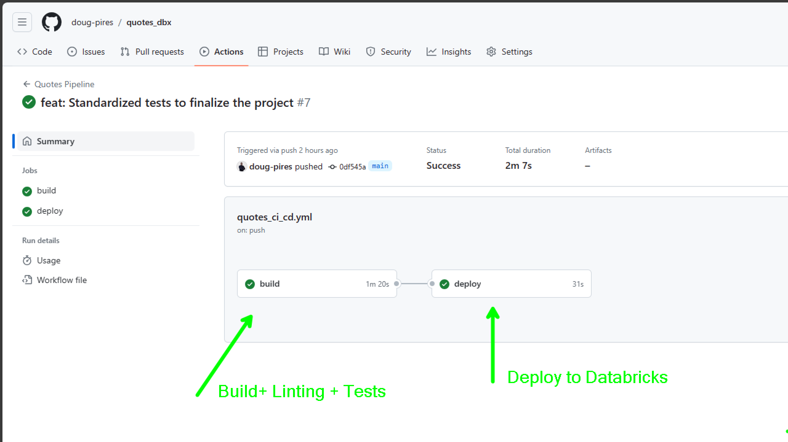
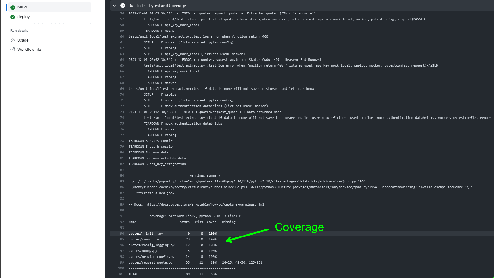
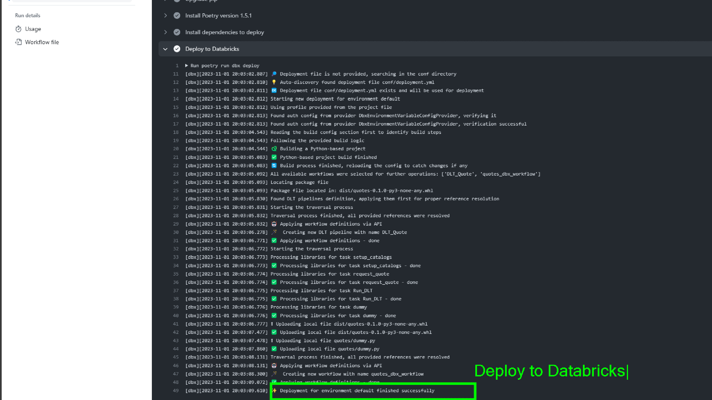
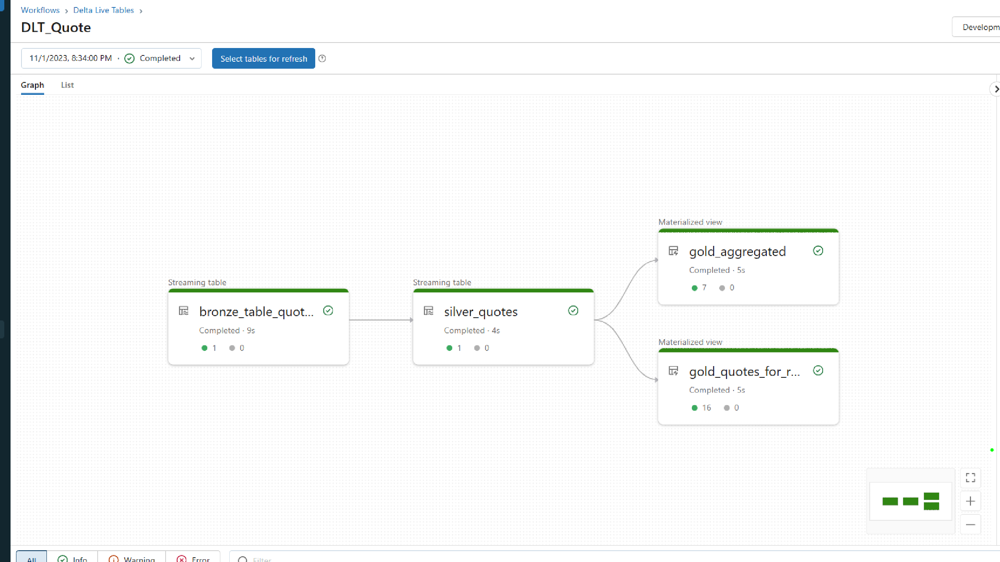
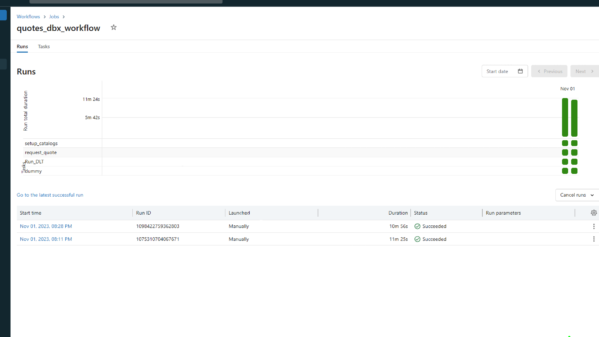
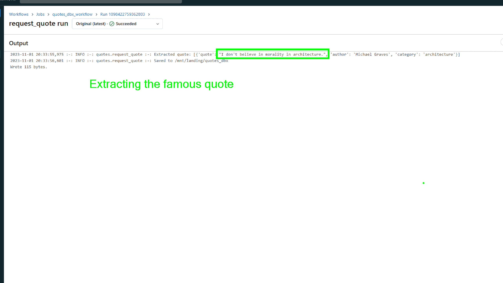
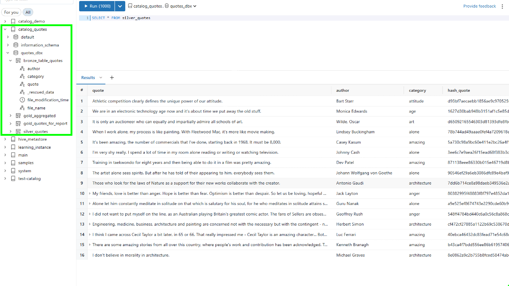
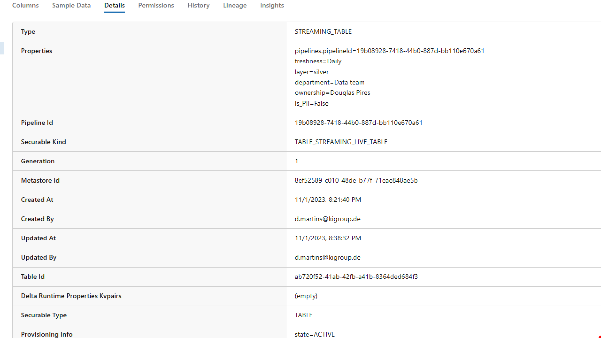

# Welcome

## dbx portfolio
- Repo : `.`
- [Documentation](https://doug-pires.github.io/quotes_dbx/) in GitHub Pages

## DAB Porfolio
- Repo: [check the repo here](https://github.com/doug-pires/quotes_dab)

---

# Purpose

I trust that you can glean valuable insights from this portfolio and apply them to real-world projects. Within these materials, I have endeavored to present essential principles, best practices, and guidelines that prove beneficial when engaged in project development as a Data Engineer, Data Analyst, or Analytics Engineer.

In accordance with the **"Pragmatic Starter Kit"** outlined in "The Pragmatic Programmer" book:
1. Version Control
2. Regression Testing
3. Full Automation

With that said let's dive in...🏊‍♂️

## What are you going to find here?

- Prioritize Version Control.
- Embrace Automation (e.g., GitHub Actions, pre-commit hooks, Azure DevOps).
- Apply Functional Programming in Data Engineering projects.
- Utilize Python **typing hints** for clarity and maintainability.
- Incorporate **Docstrings** in Python Functions (e.g., Google or Numpy style).
- Simplify documentation with **MkDocs**, **MkDocs Materials**, and Community plugins, deployed on **GitHub Pages**.
- Recognize the Importance of **Design Docs** and **RFCs** in Data Projects.
- Maintain well-formatted code with sorted imports (**Isort** and **Black**/**Blue** can help).
- Stress the Importance of Testing, leveraging **Pytest** and its plugins for `fixtures`, `markers`, and `conftest` files.
- Use the library `chispa` to test `pyspark` dataframes
- Implement the **Given-When-Then** pattern derived from **Behavior-Driven Development (BDD)** in test cases.
- Monitor code coverage with **pytest-cov** and **coverage** tools.
- Follow the **DRY Principle** (Don't Repeat Yourself) to avoid redundancy in your code.
- And many more +++

## Technology Tools

- Utilize `Poetry` for dependency management and packaging.
- Leverage the **Databricks** stack to streamline the process of creating scalable data engineering projects in your local IDE (in my case, VSCode) and running them remotely.
- Explore how **dbx** and the newest released **Databricks Asset Bundles** make it easy to manipulate Databricks Assets.
- Experience the powerful combination of **Delta Live Tables** and **Autoloader**, a match made in heaven for data ingestion.

To sum up, there is no jack of all trades, always you will need specific tools to accomplish a goal.
However good principles applied and well solidified, avoid big headaches in the future, be for a change request, add new use cases, transfer of ownership or onboarding a new joiner.

---

# Pics to give you a flavor

## Jobs in CI/CD

---
## Coverage

---
## Deploy

---
## Graphic and Lineage from Delta Live Tables

---
## Workflow in Databricks

---
## The quote

---
## Catalog and Delta Tables

---
## Delta Table Properties defined in the pipeline

# Everything showed in the images, you can find on the repo and more nitty-gritty details in [documentation](https://doug-pires.github.io/quotes_dbx/)
# Enjoy  💕 💞

